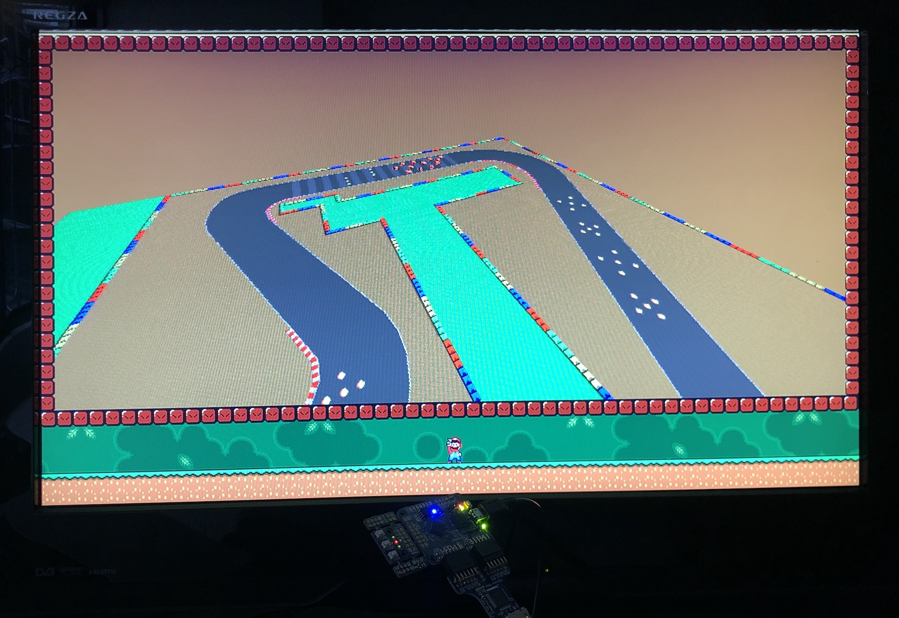

# icestation-32

This is a compact open-source FPGA game console targetting the Lattice iCE40 UltraPlus series. It's being developed using the open-source yosys and nextpnr tools and can be run on both the [iCEBreaker](https://github.com/icebreaker-fpga/icebreaker) and [ULX3S](https://github.com/emard/ulx3s)* boards. It requires the 12bpp HDMI PMOD for video output.

This repo is still in its early stages and its and contents (including this README) are changing rapidly.

*: Only the ECP5-45F and 85F have the 128kbyte of block RAM required



## Features

* RISC-V CPU (configurable with VexRiscV or PicoRV32)
* 64kbyte of CPU RAM (2x SPRAM)
* 64kbyte VDP RAM (2x SPRAM)
* Custom VDP for smooth-scrolling layers and sprites
* Custom "copper" coprocessor integrated into VDP to perform raster effects
* Configurable video modes of 640x480@60hz or 848x480@60hz
* 4bpp graphics assembled from 8x8 tiles
* ARGB16 colors arranged into 16 palettes of 16 colors each
* Optional alpha blending using 4bit alpha intensity**
* 3x or 4x scrolling layers up to 1024x512 pixels each*
* 1x 1024x1024 pixel affine-transformable layer*
* 256x sprites of up to 16x16 pixels each
* 1060+ sprite pixels per line depending on clock and video mode
* (S)NES-compatible pad interface***

*: Only one of these layer types can be enabled at any given time but they can be toggled multiple times in a frame using raster-timed updates. The 4x layer implementation is still included in this repo but was disabled due to VRAM usage constraints.

**: Visual artefacts can been seen if more than one alpha-enabled layer intersects with another i.e. using overlapping sprites.

***: While the system does have the pad interface implemented, it is only connected to a mock interface on the iCEBreaker board to use the 3 available buttons. Atleast one SNES PMOD is in development. When the ULX3S target is ready, more options for input will be available (i.e. more buttons, USB, Bluetooth...)

## Usage

### Prerequisites

* [yosys](https://github.com/YosysHQ/yosys)
* [nextpnr](https://github.com/YosysHQ/nextpnr) (-ice40 for iCEBreaker, -ecp5 for ULX3S)
* [icetools](https://github.com/YosysHQ/icestorm) (if building for iCEBreaker)
* [GNU RISC-V toolchain](https://github.com/riscv/riscv-gnu-toolchain) (newlib)

While the RISC-V toolchain can be built from source, the PicoRV32 repo [includes a Makefile](https://github.com/cliffordwolf/picorv32#building-a-pure-rv32i-toolchain) with convenient build-and-install targets. This project only uses the `RV32I` ISA. Those with case-insensitive file systems will likely have issues building the toolchain from source. If so, binaries of the toolchain for various platforms are available [here](https://github.com/xpack-dev-tools/riscv-none-embed-gcc-xpack/releases/tag/v8.3.0-1.1).

The open-tool-forge [fpga-toolchain](https://github.com/open-tool-forge/fpga-toolchain) project also provides nightly builds of most of these tools.

### Build and program bitstream

#### iCEBreaker

```
cd hardware
make icebreaker_prog
```

#### ULX3S

```
cd hardware
make ulx3s_prog
```

### Programming software

Demo software is included under `/software` and can be programmed separately. For example, to build and program the `sprites` demo:

### iCEBreaker

```
cd software/sprites/
make
iceprog -o 2M prog.bin
```

### ULX3S

```
cd software/sprites/
make
fujprog -j flash -f 0x200000 prog.bin
```

### Running simulator (Verilator or CXXRTL, plus SDL2)

A simulator using SDL2 and its documentation is included in the [/simulator](simulator/) directory.

Demo software and simulator screenshots are included in the [/software](software/) directory.

## Configuration

### CPU

One of two RISC-V implementations can be selected. The implementation is chosen using the boolean `USE_VEXRISCV` parameter in the `ics32` module.

* PicoRV32: Enabled when `USE_VEXRISCV=0`. This was the original choice and the rest of the system was designed around its shared bus interface. While it is not as compact as the Vex, it is much faster to run in simulators as it is fully synchronous.
* VexRiscV (default): Enabled when `USE_VEXRISCV=1`. This was a later addition. A wrapper module is used to bridge between the Vex split IBus/DBus and the Pico-compatible shared bus. It is the more compact CPU which is especially important considering the size of the up5k target.

### Video modes

One of two video modes can be selected and only when the project is built. The video modes can't be toggled in software. The `VIDEO_MODE` variable in [/hardware/Makefile](hardware/Makefile) selects which video mode to use. This Makefile variable in turn determines the value of the `ENABLE_WIDESCREEN` parameter in the `ics32` module.

Currently only an iCEBreaker target is provided with these configurations:

* 640x480@60hz: 25.175MHz VDP/CPU clock
* 848x480@60hz: 33.75MHz VDP clock, 16.88MHz CPU clock

Note the 848x480 video has two clock domains because the up5k cannot run the CPU at 33.75MHz and meet timing. The dual clock domain setup is automatically enabled when `ENABLE_WIDESCREEN` is set. The `FORCE_FAST_CPU` parameter is also available to force the single clock domain setup which fails timing in the 848x480 case, although the author hasn't seen it break even with substantial overclock.

## TODO

* A better README file!
* More demo software for sprites / scrolling layers / raster effects etc.
* Many bits of cleanup and optimization
* Gamepad support, when the PMODs become available

