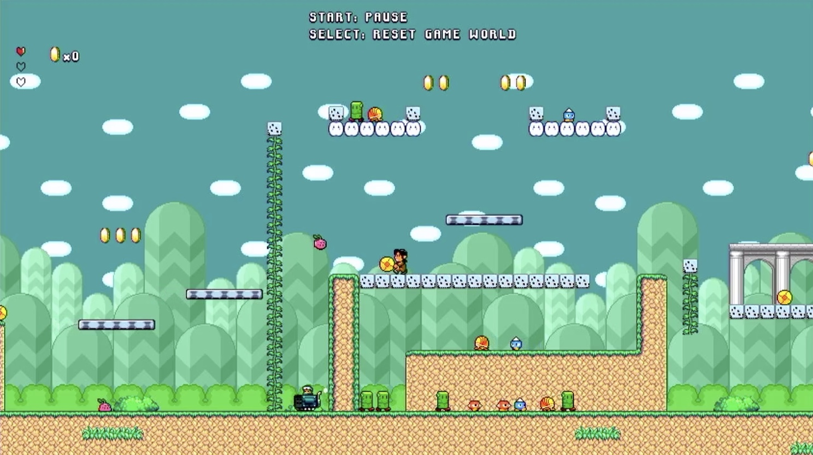

# icestation-32

This is a compact open-source FPGA game console targetting the Lattice iCE40 UltraPlus series. It's being developed using the open-source yosys and nextpnr tools and can be run on both the [iCEBreaker](https://github.com/icebreaker-fpga/icebreaker)** and [ULX3S](https://github.com/emard/ulx3s)* boards.

As a retro-inspired console, it does not use framebuffers, rasterizers, shaders etc. It uses character maps, sprites and raster effects to implement various effects. This allows it to render 480p scenes from 64KByte.

*: Only the ECP5-45F and 85F have the 128kbyte of block RAM required. It's been confirmed working on boards with Winbond flash but thought to work on others too. Potentially boards with a 25F can be supported by moving the CPU RAM to external memory.

**: iCEBreaker requires the additional 12bpp HDMI PMOD for video output. On the ULX3S, the onboard GPDI port is used for video output.

## Video capture from ULX3S (DVI video)


Platformer game hosted [here](https://github.com/dan-rodrigues/super-miyamoto-sprint).

## Demo running on iCEBreaker


Demo with placeholder assets just for illustration. This along with other similarly copyrighted assets are not published here.

## Features

* RISC-V CPU (configurable with VexRiscV or PicoRV32)
* Custom VDP for smooth-scrolling layers and sprites
* Custom "copper" coprocessor integrated into VDP to perform raster effects
* [Custom multichannel ADPCM decoder / mixer](https://github.com/dan-rodrigues/ics-adpcm) (44.1KHz, 16bit stereo)
* Configurable video modes of 640x480@60hz or 848x480@60hz
* 4bpp graphics assembled from 8x8 tiles
* ARGB16 colors arranged into 16 palettes of 16 colors each
* Optional alpha blending using 4bit alpha intensity**
* 3x or 4x scrolling layers up to 1024x512 pixels each*
* 1x 1024x1024 pixel affine-transformable layer*
* 256x sprites of up to 16x16 pixels each
* 1060+ sprite pixels per line depending on clock and video mode
* 64kbyte of CPU RAM (2x iCE40 SPRAM)
* 64kbyte VDP RAM (2x iCE40 SPRAM)
* (S)NES-compatible pad interface***

The system doesn't require any RAM beyond what is available in the iCE40 UP5K.

*: Only one of these layer types can be enabled at any given time but they can be toggled multiple times in a frame using raster-timed updates. The 4x layer implementation is still included in this repo but was disabled due to VRAM usage constraints.

**: Visual artefacts can been seen if more than one alpha-enabled layer intersects with another i.e. using overlapping sprites.

***: PCB push buttons are used by default. although an original SNES gamepad can be used.

## Usage

### Prerequisites

* [yosys](https://github.com/YosysHQ/yosys)
* [nextpnr](https://github.com/YosysHQ/nextpnr) (-ice40 for iCEBreaker, -ecp5 for ULX3S)
* [icetools](https://github.com/YosysHQ/icestorm) (if building for iCEBreaker)
* [GNU RISC-V toolchain](https://github.com/riscv/riscv-gnu-toolchain) (newlib)
* [fujprog](https://github.com/kost/fujprog) (if flashing to ULX3S)

While the RISC-V toolchain can be built from source, the PicoRV32 repo [includes a Makefile](https://github.com/cliffordwolf/picorv32#building-a-pure-rv32i-toolchain) with convenient build-and-install targets. This project only uses the `RV32I` ISA. Those with case-insensitive file systems will likely have issues building the toolchain from source. If so, binaries of the toolchain for various platforms are available [here](https://github.com/xpack-dev-tools/riscv-none-embed-gcc-xpack/releases/tag/v8.3.0-1.1).

The open-tool-forge [fpga-toolchain](https://github.com/open-tool-forge/fpga-toolchain) project also provides nightly builds of most of these tools.

### Build and program bitstream

#### iCEBreaker

```
cd hardware
make icebreaker_prog
```

#### ULX3S

```
cd hardware
make ulx3s_prog
```

### Programming software

Demo software is included under `/software` and can be programmed separately. For example, to build and program the `sprites` demo:

### iCEBreaker

```
cd software/sprites/
make icebreaker_prog
```

### ULX3S

```
cd software/sprites/
make ulx3s_prog
```

Note that fujprog can be slow to flash larger files. Programming over WiFi [using the ESP32](https://github.com/emard/esp32ecp5) can be done as a faster alternative.

### Running simulator (Verilator or CXXRTL, plus SDL2)

A simulator using SDL2 and its documentation is included in the [/simulator](simulator/) directory.

Demo software and simulator screenshots are included in the [/software](software/) directory.

## Configuration

### CPU

One of two RISC-V implementations can be selected. The implementation is chosen using the boolean `USE_VEXRISCV` parameter in the `ics32` module.

* PicoRV32: Enabled when `USE_VEXRISCV=0`. This was the original choice and the rest of the system was designed around its shared bus interface. While it is not as compact as the Vex, it is much faster to run in simulators as it is fully synchronous.
* VexRiscV (default): Enabled when `USE_VEXRISCV=1`. This was a later addition. A wrapper module is used to bridge between the Vex split IBus/DBus and the Pico-compatible shared bus. It is the more compact CPU which is especially important considering the size of the UP5K target.

### Video modes

One of two video modes can be selected and only when the project is built. The video modes can't be toggled in software. The `VIDEO_MODE` variable in [/hardware/Makefile](hardware/Makefile) selects which video mode to use. This Makefile variable in turn determines the value of the `ENABLE_WIDESCREEN` parameter in the `ics32` module.

* 640x480@60hz: 25.175MHz VDP/CPU clock
* 848x480@60hz: 33.75MHz VDP clock, 16.88MHz CPU clock

### CPU and VDP clock domains

The 848x480 video mode has two clock domains because the UP5K cannot run the CPU at 33.75MHz while also  meeting timing. For the `icebreaker` target, the dual clock domain setup is automatically enabled when `ENABLE_WIDESCREEN` is set. This can otherwise be manually configured using the `ENABLE_FAST_CPU` parameter.

If the `ENABLE_FAST_CPU` parameter is set, there is only one clock domain with the CPU running at the VDP clock. Otherwise, the CPU runs at half the VDP clock as shown above.

The ULX3S can run the CPU at the video clock (and beyond) but it defaults to the same configuration as the iCEBreaker for consistency. This also means software running on one platform will behave identically on the other.

## Audio

### iCEBreaker

The `GAMEPAD_PMOD` parameter enables audio output using the 1BitSquared gamepad / audio PMOD. A stereo PDM DAC is used with this PMOD. This is the only option available for audio on the iCEBreaker.

### ULX3S

Audio is output through the headphone jack in both analog / digital form:

* Analog output direct to headphones (noisy)
* Digital SPDIF using a 3.5mm -> RCA cable. The "composite video" cable can be plugged into the coax-in of an SPDIF receiver.

## Controls

The assumed controller layout matches an original SNES gamepad.

By default, the controller is implemented using push buttons on the PCBs. Both the ULX3S and iCEBreaker buttons (on break out board) can be used but inputs are limited.

### iCEBreaker

The `GAMEPAD_PMOD` parameter in the [top level module](/hardware/icebreaker/ics32_top_icebreaker.v) can be set to use an original SNES gamepad  rather than the 3 buttons on the breakout board.

### ULX3S

The `GAMEPAD_SOURCE` parameter in the [top level module](/hardware/ulx3s/ics32_top_ulx3s.v) sets the controller input. This string must be set to one of three values:

* `PCB`: PCB buttons (default, limited inputs)
* `USB`: USB gamepad (if the gamepad to be used has a corresponding HID report decoder)
* `BLUETOOTH`: Bluetooth gamepad

For the `USB` option, HID report descriptors aren't parsed so a fixed layout is assumed. More gamepads can be added over time since the only addition needed is a HID report decoder. The `USB_GAMEPAD` parameter selects which decoder to use and [this file](/hardware/usb/gamepads/usb_gamepad_reader.v) shows which gamepads are supported.

For the `BLUETOOTH` option, an ESP32 program must be flashed first. A [separate repo](https://github.com/dan-rodrigues/ulx3s-bluetooth-gamepad) has the instructions on setting this up. The `BLUETOOTH` option will not do anything useful unless the ESP32 program in the linked repo is flashed first. If there's issues getting a Bluetooth gamepad to connect, pressing button 0 will reset the ESP32 (without resetting the rest of the system). This usually fixes any connection problems.

The `GAMEPAD_LED` parameter can also be set to show some some of the current button inputs. There are only 8 LEDs so not all can be seen at once. The CPU controlled LED state is otherwise shown.

## Resource usage

The logic resources used can vary a lot based on which commit was used to build yosys. This can break UP5K builds if the LC usage is too high.

yosys commit [c75d8c74](https://github.com/YosysHQ/yosys/commit/c75d8c74) produces this result which fits and routes reasonably quick:

```
Info: Device utilisation:
Info: 	         ICESTORM_LC:  4790/ 5280    90%
```

## TODO

* A better README file!
* Many bits of cleanup and optimization
* Support for more USB gamepads
* Confirm ULX3S boards with ISSI flash work as expected

