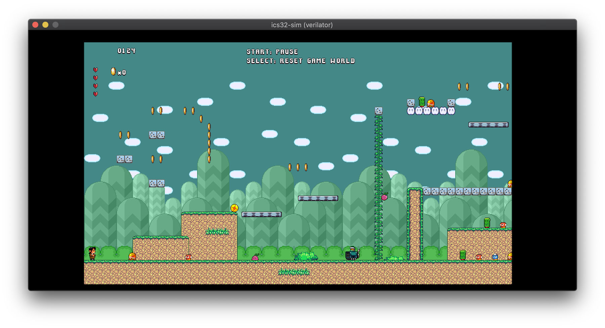

# Demo software

## Prerequisites

* GNU RISC-V toolchain
* GNU Make (any version >= 3.81 should work)

The `CROSS` variable in `common/cross.mk` must be set according to the name of your RISC-V installation.

## Simulation

`cd` into any demo directory and run `make sim`. This will:

1. Build the demo software
2. Build the simulator
3. Launch the demo in the simulator

## Running on FPGA

In any demo directory, running one of the following commands will build and flash the software onto a given board:

```
make icebreaker_prog
make ulx3s_prog
```

## Super Miyamoto Sprint

Platformer game inspired by other games of the period. Because of its size it is [hosted separately here](https://github.com/dan-rodrigues/super-miyamoto-sprint). It clones this repo as a submodule.




## `affine_platformer/`

Demo with various system features combined into a single scene including:

* Affine layer, which renders the rotating and scaling 8 ball.
* Copper coprocessor, used to do a raster-timed toggle between the affine 8 ball background and the horizontally scrolling ground.
* Sprites, displaying the hero character and the horizontally scrolling clouds.
* Gamepad input, used to make the hero jump and to manually zoom the affine layer that displays the 8 ball.


## `audio_drumkit/`

Interactive audio demo with 3 preloaded samples triggered by 3 buttons.

* Audio can be dumped to WAV by passing the `-w` switch to the sim (i.e. `-w sim.wav`).
* Audio can also be played back in realtime by passing the `-a` switch but it will sound choppy at less than 60FPS.


## `copper_polygon/`

Copper coprocessor demo using horizontal raster effects to draw a rotated, scaled polygon. The copper has a simple instruction set dedicated to performing raster-synced writes to the VDP. The CPU transforms a polygon each frame, traces its edges, then emits copper machine code used to toggle the display of a static opaque layer. The effective result is a layer mask in the shape of the transformed polygon.

The copper is implemented in vdp_copper.v and has 4kbyte of instruction memory.


## `copper_bars/`

Copper coprocessor demo using vertical raster effects only. This is a simpler demo than the above polygon demo and displays squished and strecthed "raster bars" by altering a single color each line. The bar layer itself is as a single-colored opaque layer. The apparent movement and alpha blending is done with raster effects.


## `platformer/`

Controllable character sprite that can walk and jump with simple physics on a static playfield. This uses the gamepad interface which is currently mocked using the 3 buttons on the iCEBreaker.


## `sprites/`

Animated sprites demo. A palette-based PNG file is converted to the ics-32 format and compiled into the demo. This demo also shows alpha blending of sprites onto a variable backgroud color.


## `hello_world/`

Minimal example using a single scrolling layer to display monochrome text.


## Other demos

(Twitter)

## Acknowledgements

* [Rotating crystal graphics](https://opengameart.org/content/rotating-crystal-animation-8-step) by qubodup
* [8x8 font](https://github.com/dhepper/font8x8) by dhepper
* [Super Miyamoto spritesheet](https://opengameart.org/content/super-miyamoto) by Lars Doucet & Sean Choate. Minor modifications were made for the `platformer` demo.
* [Super Mario World Redrawn](https://www.romhacking.net/hacks/2919/) game mod by IceGoom
